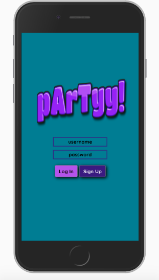
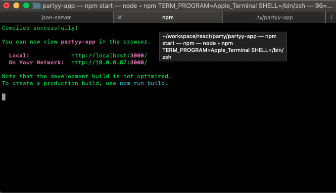
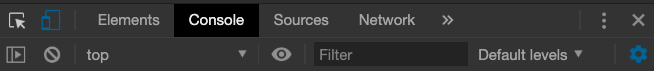
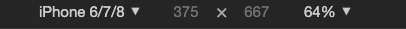
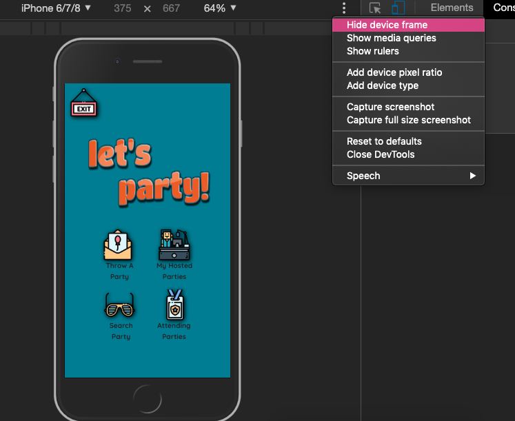

<!--  -->

Welcome to pArTyy! app. Are you a one person wolf pack? Need friends? Then that's exactly what _pArTyy!_ is, an application that allows users to do one of the following: 
+ 1. create parties that you can set to public/private and invite users
+ 2. find local parties that are public to the general public


## Getting Started

These instructions will get you a copy of the project up and running on your local machine

### Installing

First, you'll need to clone down the repo into a directory. Open your terminal and enter

```
git clone git@github.com:jameka23/partyy.git
```

After that, open up your editor. You're going to need to do the following:
You need to be in the main part of the app by entering in:

```
cd partyy-app
```

Since we will be using fake data at the time, database.json has been set up for you, go to your terminal, enter the command

```
cd api
```

You will need to run the local json-server, run the command

```
json-server -p 5002 -w database.json
```

Before we run the application, you must run the command for the React app. In the terminal, run the following command to go back to the main directory

```
cd ..
```

Then enter the following command to start using the application

```
npm start
```
Your terminal should look similar to this, with no read errors: 



The next thing to do is head over to your browser. Since this application was to mimic a mobile app, the best experience is to user Xcode's Simulator or use the Chrome Dev Tools and choose a mobile view such as the iPhone 6/7/8 with mobile framing.

Below are the steps to view the mobile version via Chrome Dev Tools:

+ click on the _toggle device toolbar_


+ choose the device you'd like to view the app on


+ lastly, add the device frame


If you using, Xcode's Simulator, open up Safari or Chrome on the simulator then enter in the following url and press enter 
```
http://localhost:3000
```

###### You are now ready to use pArTyy!. 


## First Time User instructions
* The first thing you have to do is register as new user otherwise you will not be able to use pArTyy!
* Once registered, you are now able to use the application
* Since there are only a few parties in the database, you need create a party.


### I hope you enjoyed my app! :)


## Built With

* [react.js](https://reactjs.org/) - The framework used
* [reactstrap](https://reactstrap.github.io/) - Particular styling
* [CSS](https://css-tricks.com/) - Main styling
* [Bootstrap4.3](https://getbootstrap.com/) - Used for some styling
* [geocode](https://www.npmjs.com/package/react-geocode) - npm package for lat/long conversion


## Authors

* **Jameka Echols** 

## Acknowledgments

* [FlatIcon](www.flaticon.com)- Icon made by Freepik
* [Freepik](http://creativecommons.org/licenses/by/3.0/") - CC 3.0 BY
* [Darius_Dan](https://www.flaticon.com/authors/darius-dan") - FlatIcon Author
* [Kiranshastry](https://www.flaticon.com/authors/kiranshastry") - FlatIcon Author
* [Smashicons](https://www.flaticon.com/<?=_('authors').'/'?>smashicons") - FlatIcon Author
* [PurpleBooth](https://gist.githubusercontent.com/PurpleBooth/109311bb0361f32d87a2/raw/8254b53ab8dcb18afc64287aaddd9e5b6059f880/README-Template.md) - For their template
